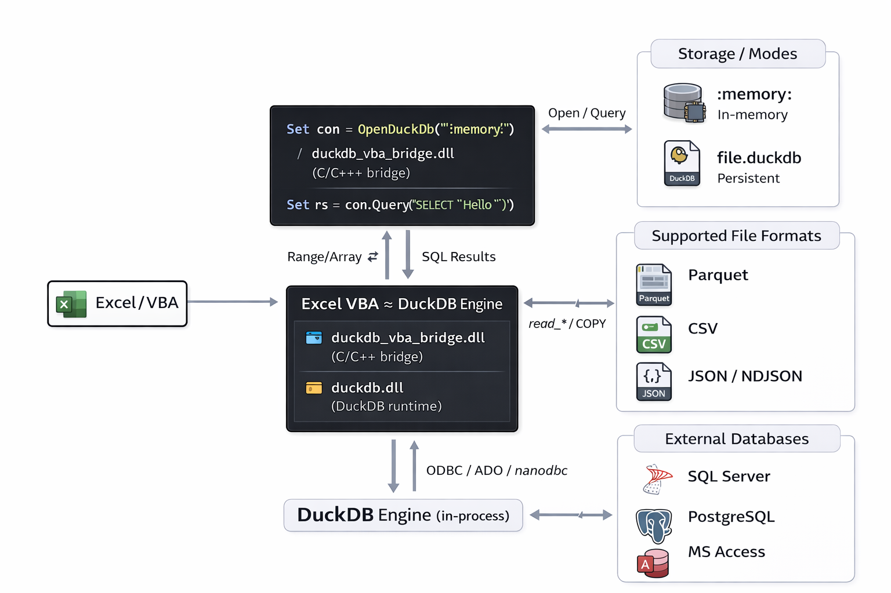

# DuckDB for Excel/VBA – Native DuckDB C API Integration

<p align="center">
  
</p>

> **DuckDB for Excel/VBA using the native DuckDB C API via a lightweight DLL bridge, Boost VBA with an embedded OLAP engine**  
 
- ✅ Replace slow VBA loops / ADO bottlenecks
- ✅ Use DuckDB as a modern **MS Access alternative** (single portable `.duckdb` file)
- ✅ **Pandas-like analytics in VBA**: run fast SQL on an in-memory DuckDB (`:memory:`)
- ✅ Work with **Parquet / CSV / JSON** from VBA at high speed (read, transform, export)
- ✅ Ultra-fast **Range/Array ⇄ DuckDB** ingestion + upserts + dictionary lookups
- ✅ Easier integration with external databases (**SQL Server / PostgreSQL**)
- ✅ **Access → DuckDB migration** helpers (e.g. `AppendAdoRecordsetFast`) for quick conversion of legacy .mdb/.accdb data

---
- 📖 **Documentation (PDF)**: [DuckVBA_documentation_EN.pdf](DuckVBA_documentation_EN.pdf?raw=1)
- 🧪 **Excel/VBA tutorial workbook (XLSM)**: [DuckDB_VBA_Tutorial_fr.xlsm](https://github.com/EtienneLenoir/DuckDB-VBA-DLL/raw/main/tutorial/DuckDB_VBA_Tutorial_fr.xlsm)
- ➡️ **Download**: see [**Releases**](../../releases) for a ready-to-run ZIP (DLLs + VBA modules + demo XLSM).
- 👉 Next: [**Quick install (VBA)**](#quick-install-vba)

<details>
  
<summary><b>Table of contents</b></summary>

- [Why this project?](#why-this-project)
- [Highlights](#highlights)
- [Requirements](#requirements)
- [Quick install (VBA)](#quick-install-vba)
- [Connections: file, memory, read-only](#connections-file-memory-read-only)
  - [In-memory DB (ultra fast)](#in-memory-db-ultra-fast)
  - [File DB (persistent)](#file-db-persistent)
  - [Read-only (safe reporting / audit)](#read-only-safe-reporting--audit)
- [VBA API (toolbox level)](#vba-api-toolbox-level)
- [Import / Export (CSV, JSON, Parquet)](#import--export-csv-json-parquet)
  - [CSV](#csv)
  - [JSON](#json)
  - [Parquet](#parquet)
- [Extensions (examples)](#extensions-examples)
  - [miniplot (HTML charts)](#miniplot-html-charts)
  - [rapidfuzz (fuzzy search)](#rapidfuzz-fuzzy-search)
  - [nanodbc (Access via ODBC, from DuckDB)](#nanodbc-access-via-odbc-from-duckdb)
  - [ui (DuckDB UI)](#ui-duckdb-ui)
- [Repository layout (typical in this project)](#repository-layout-typical-in-this-project)
- [Build / packaging (DLL)](#build--packaging-dll)
- [License](#license)
- [Disclaimer](#disclaimer)
- [Support / contributions](#support--contributions)

</details>

<p align="center"><b>Architecture overview (DuckDB VBA)</b></p>
<p align="center">
  
</p>

## Why this project?

Excel/VBA is still unbeatable for the “last mile” (UI, validation, reporting), but it becomes slow and brittle as soon as you hit serious data workloads:
- costly VBA loops,
- ADO/ODBC friction at larger volumes,
- MS Access is convenient but quickly caps out for modern data workflows.

**DUCK VBA DLL** brings a modern OLAP engine (DuckDB) to VBA: JOIN/GROUP BY/CTE/WINDOW, columnar scans, vectorized execution, multi-threading, Parquet/JSON/CSV read & write… while keeping Excel as the front-end.

## Highlights

- **Zero server**: DuckDB embedded in-process, local, no instance to maintain.
- **Simple deployment**: one bridge DLL + `duckdb.dll` (next to the `.xlsm`).
- **Two database modes**:
  - `:memory:` for ultra-fast **RAM pipelines**,
  - `.duckdb` file for persistence and portability.
- **Fast ingestion from Excel** (no intermediate CSV): `Range.Value2` → `AppendArray` / `FrameFromValue` (native appender).
- **Efficient exports**:
  - `SELECT` → `Variant(2D)` (paste directly to worksheet),
  - `SELECT` → `Dictionary` (ultra-fast in-memory lookups in VBA),
  - `COPY TO` Parquet/JSON/CSV.
- **Access → DuckDB made easy**: import tables fast with `AppendAdoRecordsetFast` (quick migration from legacy `.mdb/.accdb`)
- **Build your own “pandas-like” toolkit**: `FrameFromValue` turns any `Variant(2D)` into an in-memory table you can slice/filter/join/aggregate in SQL
- **Toolkit-ready features**:
  - upsert (sync Excel → DuckDB),
  - temp lists (replace huge `WHERE IN (...)`),
  - scalar helpers,
  - Access import (ADO/DLL) + optional nanoODBC route,
  - DuckDB extensions (miniplot, rapidfuzz, ui…).

## Requirements

- Windows
- **Excel 64-bit** (VBA7)
- `duckdb.dll` (DuckDB runtime)
- `duckdb_vba_bridge.dll` (bridge DLL)
- **Microsoft Visual C++ Redistributable 2015–2022 (x64)**  
  (often already installed with common apps like Office/Teams/Visual Studio.  
  If Excel can’t load the DLLs or you see missing `vcruntime140*.dll` / `msvcp140.dll`, install it:  
  https://aka.ms/vc14/vc_redist.x64.exe)
> ⚠️ After downloading/copying: right-click `duckdb.dll` and `duckdb_vba_bridge.dll` → **Properties** → **Unblock** (otherwise Excel may refuse to load them).

## Quick install (VBA)

1) Put `duckdb.dll` + `duckdb_vba_bridge.dll` in your workbook folder (or a subfolder).  
2) Import into your VBA project at minimum:
- `mDuckNative.bas`
- `cDuck.cls`

3) Minimal example:

```vb
Sub Quickstart_DuckVba()

    Dim db As New cDuck,v As Variant

    '1) Init (DLL location)
    db.Init ThisWorkbook.Path
    db.ErrorMode = 2  '2=LogOnly (debug via duckdb_errors.log), 1=MsgBox, 0=Raise

    '2) Choose your mode:
    db.OpenDuckDb ":memory:"                             '100% RAM, no disk I/O, ideal for ETL & analytics
    'db.OpenDuckDb ThisWorkbook.Path & "\cache.duckdb"   'persistent file (read/write, Access-like)
    'db.OpenReadOnly ThisWorkbook.Path & "\cache.duckdb" 'read-only file (safe reporting / audit)

    '3) SQL analytics (DDL/DML)
    db.Exec "CREATE TABLE t(id INT, name TEXT);"
    db.Exec "INSERT INTO t VALUES (1,'Duck'),(2,'VBA');"

    '4) SELECT -> Variant(2D) (ligne 1 = headers)
    v = db.QueryFast("SELECT * FROM t ORDER BY id;")

    '5) Display
    If Not IsEmpty(v) Then
        ActiveSheet.Range("A1").Resize(UBound(v, 1), UBound(v, 2)).Value2 = v
    End If

CleanExit:
    On Error Resume Next
    db.CloseDuckDb
End Sub
```

## Connections: file, memory, read-only

### In-memory DB (ultra fast)
```vb
db.OpenDuckDb ":memory:"
```
- no disk I/O
- perfect for throwaway ETL, staging, intermediate computations

### File DB (persistent)
```vb
db.OpenDuckDb ThisWorkbook.Path & "\cache.duckdb"
```
- single portable file
- great for a local “mini data warehouse” (Access-like, but OLAP)

### Read-only (safe reporting / audit)
```vb
db.OpenReadOnly ThisWorkbook.Path & "\cache.duckdb"
```
- no writes allowed
- useful for predictable “read/report” use-cases


## VBA API (toolbox level)

In `cDuck` (high-level wrapper):

### SQL execution
- `db.Exec sql` : DDL/DML/COPY/transactions
- `db.QueryFast(selectSql) As Variant` : `SELECT` → `Variant(2D)` (row 1 = headers)
- `db.Scalar(selectSql) As Variant` : `SELECT` 1x1 → value

### Ingest from Excel
- `db.FrameFromValue frameName, v2d, hasHeader, makeTemp`
- `db.AppendArray tableName, v2d, hasHeader`

### Synchronization (upsert)
- `db.UpsertFromArray tableName, v2d, headerRow, keyColsCsv`

### “Temp list” (bulk keys)
- `db.CreateTempList tabName, keys, sqlType`  
  then `... WHERE x IN (SELECT v FROM tabName)` or `JOIN tabName ...`

### Dictionaries (in-memory lookups)
- `db.SelectToDictFlat(...)` : `key → value`
- `db.SelectToDictRow1D(...)` : `key → Variant(1D)` (values only, very fast)
- `db.SelectToDictRow2D(...)` : `key → Variant(2D)` (labels + values, more self-describing)

### DuckDB extensions
- `db.LoadExt "parquet"` / `"json"` / `"rapidfuzz"` / `"miniplot"` / `"nanodbc"` / `"ui"` …


## Import / Export (CSV, JSON, Parquet)

### CSV

**Import** (auto-detect into a table):
```sql
CREATE OR REPLACE TABLE data AS
SELECT * FROM read_csv_auto('path/to/file.csv', HEADER=true);
```

**Append** (COPY):
```sql
COPY data FROM 'path/to/file.csv' (AUTO_DETECT true, HEADER true);
```

**Export**:
```sql
COPY (SELECT * FROM data) TO 'out.csv' (HEADER true);
```

### JSON

**Auto import (JSON / NDJSON)**:
```sql
CREATE OR REPLACE TABLE j AS
SELECT * FROM read_json_auto('path/to/file.json');
```

**Export**:
```sql
COPY (SELECT * FROM j) TO 'out.json' (FORMAT JSON);
```

### Parquet

**Direct read**:
```sql
SELECT * FROM read_parquet('path/to/file.parquet');
```

**Materialize into a table**:
```sql
CREATE OR REPLACE TABLE p AS
SELECT * FROM read_parquet('path/to/file.parquet');
```

**Export Parquet**:
```sql
COPY (SELECT * FROM p) TO 'out.parquet' (FORMAT PARQUET);
```

> The toolkit also provides helper shortcuts for common copy/select-to-parquet flows.


## Extensions (examples)

### miniplot (HTML charts)

- `LOAD miniplot;`
- typical functions: `bar_chart`, `line_chart`, `scatter_chart`, `area_chart`, `scatter_3d_chart`  
The module demonstrates a robust pattern:
- try “direct file generation” first
- fallback to “HTML returned as text” → write file in VBA → open in browser

### rapidfuzz (fuzzy search)

- `LOAD rapidfuzz;`
- functions: `rapidfuzz_ratio`, `rapidfuzz_jaro_winkler_*`, `rapidfuzz_prefix_*`, `rapidfuzz_postfix_*`, `rapidfuzz_osa_*`, `rapidfuzz_partial_ratio`  
Typical use: typo-tolerant search (names, tickers, venues…).

### nanodbc (Access via ODBC, from DuckDB)

- `LOAD nanodbc;`
- `odbc_query` (Access/ACE SQL executed by the driver) or `odbc_scan` (raw table copy)
> Alternative path: Access ingestion via ADO + `AppendAdoRecordset` (often very fast and with fewer extension deployment dependencies).

### ui (DuckDB UI)

- `LOAD ui;`
- `CALL start_ui();` then open local UI (runs a local UI server)
- keep a VBA connection alive to keep the UI server running


## Repository layout (typical in this project)

### C / bridge DLL
- `duckdb_vba_bridge.c` : native bridge (Unicode, SAFEARRAY/VARIANT, appender, error buffer…)

### Core VBA
- `mDuckNative.bas` : `Declare PtrSafe` prototypes + native helpers
- `cDuck.cls` : high-level wrapper (clean API for VBA)
- `cHiPerfTimer.cls` : high-resolution timing (benchmarks)

### Feature modules & demos
- `Mod1DuckDb_Begin.bas` : getting started / first demos
- `Mod2DuckDb_Info.bas` : catalog introspection (tables/columns, exists, rename…)
- `Mod2DuckDb_Scalar.bas` : scalar helpers
- `Mod1DuckDb_Csv.bas`, `Mod1DuckDb_Json.bas`, `Mod1DuckDb_Parquet.bas` : import/export
- `Mod2DuckDb_DictFlat.bas`, `Mod2DuckDb_DictRow1D.bas`, `Mod2DuckDb_DictRow2D.bas` : dictionaries
- `Mod2DuckDb_ExcelUpdate.bas` : Excel ⇄ DuckDB sync via upsert
- `Mod2DuckDb_WhereInSimple.bas`, `Mod2DuckDb_WhereInFct.bas` : temp lists / WHERE IN patterns
- `Mod2DuckDb_Extension.bas`, `Mod2DuckDb_Miniplot_Ext.bas`, `Mod2DuckDb_RapidFuzz_Ext.bas`, `Mod2DuckDb_CI_Ext.bas` : extensions
- `Mod3DuckDb_1AccessToDuck_main.bas`, `Mod3DuckDb_2AccessToDuck_dll.bas`, `Mod3DuckDb_3Nanodbc_Ext.bas` : Access → DuckDB (multiple routes)
- `Mod3DuckDb_RowStream.bas` : “row streaming” patterns


## Build / packaging (DLL)

- The bridge DLL is written in C/C++ and built with MSVC (x64).
- It links against DuckDB (runtime `duckdb.dll` + import lib depending on your build) and `oleaut32` (SAFEARRAY/VARIANT/BSTR).
- Goal: export `__stdcall` functions that are VBA-friendly, handle Unicode conversions properly, and reliably free COM/DuckDB resources.

> If you publish on GitHub, consider a clean structure: `/src` (C), `/vba` (modules), `/bin` (DLL binaries), `/docs`.


## License

- This project is licensed under the **GNU General Public License v3.0**.  
  Put the full `LICENSE` text at the repository root (recommended), and keep your license section in the docs in sync.
- The names/logos (“DUCK VBA DLL”, etc.) remain **trademarks**: see `Trademark_Policy_GPLv3.md`.


## Disclaimer

Independent project: not affiliated with DuckDB or Microsoft. “Microsoft”, “Excel”, and “VBA” are trademarks of Microsoft Corporation.


## Support / contributions

- Issues / discussions: GitHub
- Pull requests: welcome (if you accept external contributions, consider documenting the process and whether you require a CLA).

